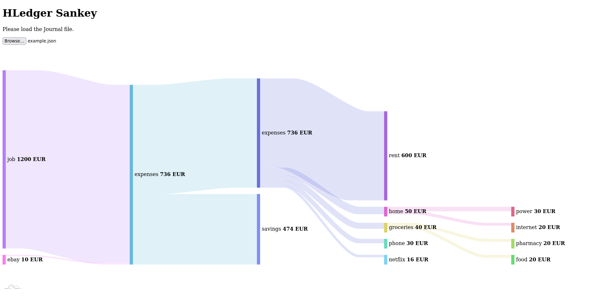

# HLedger Sankey
A HLedger Sankey visualization of your incomestatement using amCharts4.


## Example
Export the `example.journal` with:
``` sh
$ hledger -f example.journal incomestatement --cost --tree --sort-amount --output-format json > example.json
```
The result is the `example.json` file in this repository.
Open the `index.html` and load the `example.json` to reproduce the above Sankey diagram.

## Getting Started
1. Export the income statement of your journal.
``` sh
$ hledger incomestatement --cost --tree --sort-amount --output-format json > journal.json
```
2. Open the `index.html` in your browser.
3. Click `Browse` and select your exported JSON file.

## Handy Export Functions
- From .. To Export

``` sh
$ hledger incomestatement --cost --tree --sort-amount --output-format json -b 2021/04/01 -e 2021/06/30 > 2021-Q2.json
```
-  
